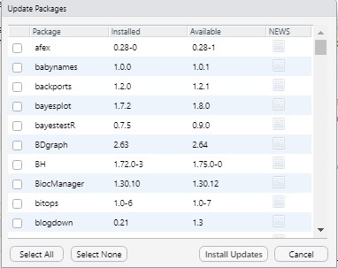

# (APPENDIX) Appendices {-}

# Exporting files from the server

If you are using the R server, you may need to export files to share them with other people or submit them for your assignments.

* First, make sure you have saved any changes you have made to the file. Do this by clicking "File - Save", Ctrl + S, or clicking the save icon. If all your changes have been saved, the save icon will be greyed out.   If there are new unsaved changes, you will be able to click the icon.
* Select the file you and to download in the files pane (bottom right) by ticking the box next to it, then click "More - Export" and save the file to your computer.  
* If you do not have R installed, DO NOT try to open it on your computer. If you do, it will open in Word, Endnote or similar, and it may corrupt your code. Only open the file if you have R and R Studio installed.  
* If you want to double check that this file is definitely the right one to submit for an assignment, you can re-upload it to the server and open it again to make sure it has the answers in it.  

# Installing R 

### Why should I install R on my computer?

The R Server is cuts down on a lot of installation problems and it means that you have all the packages and functions you need already installed. However, it requires an internet connection to use and additional when it comes time to submit your R assessments, if you don't have R on your computer it means that you won't be able to open the files you download from the server to check they're ok before you submit them.

There are some great detailed walkthrough videos by [Danielle Narvarro on YouTube](https://www.youtube.com/playlist?list=PLRPB0ZzEYegOZivdelOuEn-R-XUN-DOjd) re: how to install R on both Windows and Mac.

### Windows

If you are using Windows, you should download and install the following:

* [R](https://cran.r-project.org/bin/windows/base/)
* [R Studio](https://rstudio.com/products/rstudio/download/#download)
* [RTools](https://cran.r-project.org/bin/windows/Rtools/)

Once you've installed all three programs, restart your computer. Then, open RStudio (not R) and run the below code:

```{r eval = FALSE}
install.packages("tidyverse")
```

This will install the `tidyverse` package on your computer. If you have any problems installing R, please book into a GTA session as they should be able to help you with any installation problems.

### Mac

If you are using a Mac, you should download and install the following:

* [R](https://www.stats.bris.ac.uk/R/)  
* [R Studio](https://rstudio.com/products/rstudio/download/#download)  
* [XQuartz](https://www.xquartz.org/)  

If you have any issues installing R on your Mac, first, we recommend that you watch the [walkthrough by Danielle Navarro](https://www.youtube.com/watch?v=ay25o485YXs&list=PLRPB0ZzEYegOZivdelOuEn-R-XUN-DOjd&index=1&t=113s). 

If you have further issues on Mac, you may find this video helpful [walkthrough video](https://www.youtube.com/watch?v=90IdULVGmYY). Additionally, if you are using a Mac with the Catalina OS, we also recommend you read this [troubleshooting guide](https://psyteachr.github.io/FAQ/installing-r-and-rstudio.html#i-am-using-macos-10.15-catalina)

Once you've installed all three programs, restart your computer. Then, open RStudio (not R) and run the below code:

```{r eval = FALSE}
install.packages("tidyverse")
```

This will install the `tidyverse` package on your computer. If you have any problems installing R, please book into a GTA session as they should be able to help you with any installation problems.

### Chromebooks

Please note that you cannot currently install R on a Chromebook, please use the R Server.

# Updating R, RStudio, and packages

From time-to-time, updated versions of R, RStudio, and the packages you use (e.g., ggplot) will become available. Remember that each of these are separate, so they each have a different process and come with different considerations. We recommend updating to the latest version of all three at the start of each academic year.

### Updating RStudio

RStudio is the easiest component to update. Typically, updates to RStudio won't affect your code, instead they add in new features, like spell-check or upgrades to what RStudio can do. There's usually very little downside to updating RStudio and it's easy to do.

Click `Help - Check for updates`

```{r img-updaterstudio, echo=FALSE, fig.cap="Updating RStudio"}
knitr::include_graphics("images/update_rstudio.jpg")
```

If an update is available, it will prompt you to download it and you can install it as usual.

## Updating packages

Package developers will occasionally release updates to their packages. This is typically to add in new functions to the package, or to fix or amend existing functions. **Be aware that some package updates may cause your previous code to stop working**. This does not tend to happen with minor updates to packages, but occasionally with major updates, you can have serious issues if the developer has made fundamental changes to how the code works. For this reason, we recommend updating all your packages once at the beginning of each academic year (or semester) - don't do it before an assessment or deadline just in case!

To update an individual package, the easiest way is to use the `install.packages()` function, as this always installs the most recent version of the package.

```{r update_one, eval = FALSE}
install.packages("tidyverse")
```

To update multiple packages, or indeed all packages, RStudio provides helpful tools. Click `Tools - Check for Package Updates`. A dialogue box will appear and you can select the packages you wish to update. Be aware that if you select all packages, this may take some time and you will be unable to use R whilst the process completes.

```{r img-updateall, echo=FALSE, fig.cap="Updating packages with RStudio"}

```

Occasionally, you might have a few problem packages that seemingly refuse to update, for me, `rlang` and `vctrs` cause me no end of trouble. These aren't packages that you will likely ever explicitly load, but they're required beneath the surface for R to do things like knit your Markdown files etc.

If you try to update an existing package and get an error message that says something like `Warning in install.packages : installation of package ‘vctrs’ had non-zero exit status` or perhaps `Error in loadNamespace(i, c(lib.loc, .libPaths()), versionCheck = vI[[i]]) :  namespace 'rlang' 0.4.9 is being loaded, but >= 0.4.10 is required` one solution I have found is to manually uninstall the package, restart R, and then install the package new, rather than trying to update an existing version. The `installr` package also has a useful function for uninstalling packages.

```{r problem_packages, eval = FALSE}
# Load installr
library(installr)

# Uninstall the problem package
uninstall.packages("package_name")

# Then restart R using session - restart R
# Then install the package fresh

install.packages("package")

```

## Updating R

Finally, you may also wish to update R itself. The key thing to be aware of is that when you update R, if you just download the latest version from the website, you will lose all your packages. The easiest way to update R and not cause yourself a huge headache is to use the `installr` package. When you use the `updateR()` function, a series of dialogue boxes will appear. These should be fairly self-explanatory but there is a [full step-by-step guide available](https://www.r-statistics.com/2015/06/a-step-by-step-screenshots-tutorial-for-upgrading-r-on-windows/) for how to use `installr`, the important bit is to select "Yes" when it asked if you would like to copy your packages from the older version of R.

```{r installr, eval = FALSE}
# Install the installr package
install.packages("installr")

# Load installr
library(installr)

# Run the update function
updateR()
```

As always, if you're having issues, please ask on Teams or book into a GTA session.

# Additional R resources

If you would like additional practice, you can check out the other UofG PsyTeachR course books. 

* [Level 1](https://psyteachr.github.io/ug1-practical/) - Intro to R (overlaps with Msc Conv book), data wrangling, data viz, descriptive statistics  
* [Level 2](https://psyteachr.github.io/ug2-practical/) - Our second-year undergraduate course introduces statistical concepts such as permutation tests,t-tests, NHST, alpha, power, effect size, and sample size. Semester 2 focusses on correlations and the general linear model. 
* [Level 3](https://psyteachr.github.io/ug3-stats/): This third-year undergraduate course teaches students how to specify, estimate, and interpret statistical models corresponding to various study designs, using a General Linear Models approach.
* [MSc Data Skills](https://psyteachr.github.io/msc-data-skills/): This course provides an overview of skills needed for reproducible research and open science using the statistical programming language R. Students will learn about data visualisation, data tidying and wrangling, archiving, iteration and functions, probability and data simulations, general linear models, and reproducible workflows.

We also highly recommend the following, they will help practice your data wrangling skills but also they're great options if you're enjoying R and want to stretch yourself:

* [Open Stats Lab](https://sites.trinity.edu/osl) - this wonderful resource gives you practice at running statistical tests by providing you with datasets from published papers.
* [R for Data Science](https://r4ds.had.co.nz/) - written by the authors of the tidyverse, this is a great resource for additional data wrangling practice and more depth on many of the tidyverse functions.
* [Text Mining with R](https://www.tidytextmining.com/) - Shows you how to use R to work with text. This isn't something we cover in this course, but it uses the same data wrangling skills and be a very useful additional skill to have.
* [How to make BBC style graphics](https://bbc.github.io/rcookbook/#how_to_create_bbc_style_graphics) - Ever wondered how the BBC News makes their data visualisation? Well, now you can make your own!
* [Data Vizualisation](https://socviz.co/) - this is an entire book on data visualisation and goes into detail on how to take `ggplot` to its limits. 


# Comparing two correlations

Sometimes you will need or want to statistically compare the strength of two correlation coefficients to help determine whether they are statistically different (rather than just comparing r values). For this set of analyses you will need to install and load the `cocor` package as well as the `tidyverse` and `lsr`.

```{r load_cocor}
library(cocor)
library(tidyverse)
library(lsr)
```

The `cocor` package comes with a built-in dataset called `aptitude`. This dataset contains scores on four aptitude tests `knowledge`, `logic`, `intelligence.a`, and `intelligence.b` for two separate samples. This data is stored in a `list` object that then contains two separate data frames `sample1` and `sample2`. We haven't worked with lists much in this book but `cocor` requires the data to be in list format so it's worth spending a little time on this before we get going.

First, load the built-in aptitude dataset.

```{r}
data("aptitude")
```

You can view the contents of each dataset by calling them separately:

```{r eval = FALSE}
aptitude$sample1
aptitude$sample2
```

However, it may that your research dataset isn't structured like this and that the data for the two groups or samples you want to compare is in the same dataset (for example, for the data for your quantitative report).

The below code transforms the data to the format you're likely to have so that we can show you how to put it back into list form by using the `bind_rows()` function to pull out the two datasets, bind them together, and add on a column called `sample` that identifies which dataset the data is from.

* Run the below code and then view `full_dat` to see how it is structured.


```{r}
full_dat <- bind_rows(aptitude$sample1, aptitude$sample2, .id = "sample")
```

This is how the data for your quantitative report is structured. All the data you have is in a single table and there is a column that tells you what group it is from (in this case `sample` but for the quant report this might be gender or whether the student is mature).

To use `cocor` to compare the correlations you will need to transform it into a list object. We achieve this by creating two separate objects for each sample using `filter()` and then we combine them back into a `list`. We've also added in the code to ensure that the table is a data frame because `cocor` is a bit fussy about what it needs.

```{r}
sample1 <- full_dat %>%
  filter(sample == 1)

sample2 <- full_dat %>%
  filter(sample == 2)

dat_list <- list(sample1 = as.data.frame(sample1),
                 sample2 = as.data.frame(sample2))
```

This is somewhat convoluted but the key takeaway is that if you want to use `cocor` to compare correlations, you need to ensure your data is in a list object and that may require the above transformation.

### Compare two correlations based on two independent groups

In this example we want to compare two correlations from two independent groups, i.e., where the participants involved in each correlation are completely different. Let's run the correlations for the full dataset, and then for sample 1 and sample 2 separately.

```{r}
cor.test(full_dat$logic, full_dat$intelligence.a, method = "pearson")
cor.test(sample1$logic, sample1$intelligence.a, method = "pearson")
cor.test(sample2$logic, sample2$intelligence.a, method = "pearson")
```

Here we can see that the correlations between logic scores and intelligence.a scores are significant overall and in both samples separately, however, the correlation for sample 1 is larger (r = .32) than for sample 2 (r = .20) and so we can compare these using `cocor`.

* The left-hand side of the formula (before the `|`) refers to variables in the first dataset in the list, the right-hand side of the formula (after the `|`) refers to variables in the second dataset in the list. 
* This comparison requires us to use the list object we created.

```{r}
cocor(formula = ~logic + intelligence.a | logic + intelligence.a, 
      data = dat_list)
```

The full paper by [Diedenhofen and Musch (2015)](https://journals.plos.org/plosone/article?id=10.1371/journal.pone.0121945#sec003) explains the output in detail, for our purposes, Fisher's z-test tells us that our correlations are not significantly different (z = 1.59, p = .113) and Zou's confidence intervals gives us the CI for the size of the difference between the two correlations (which at -0.0281 - 0.2637 is quite a range and so isn't surprising that the two are not statistically different).

#### Visualising two groups correlations

Rather than producing two separate scatterplots, it can be useful to display the data from bot groups on the same plot. For the dataset we have, this requires a little bit of wrangling first, if you have all the data from both groups in one object, you could skip step one.

* The `colour` argument tells `ggplot()` to draw the `geom_jitter()` and `geom_smooth()` in different colours for each level of `sample`.
* We're using `geom_jitter()` instead of `geom_point()` because many of the data points overlap - try changing it to `geom_point()` and see how it looks.
* 

```{r fig.cap= "Scatterplot comparing correlation between two variables for two groups"}
ggplot(full_dat, aes(x = logic, y = intelligence.a, 
                         colour = sample)) +
  geom_jitter() +
  geom_smooth(method = "lm") +
  theme_minimal() +
  scale_colour_viridis_d(option = "E")
```


### Compare two overlapping correlations based on two dependent groups

In this example, we want to compare two correlations from two dependent groups (i.e., the participants are the same) and where one of the variables is also the same, i.e., it overlaps.

For example, let's run all possible correlations for sample 2:

```{r}
sample2 %>%
  correlate(test = TRUE, p.adjust.method = "holm")
```

We see that the correlations between `logic`, `intelligence.a` and `intelligence.b` are all significant. We can assess whether the correlation between `logic` and `intelligence.a` is strong than with `intelligence.b`.

* Note that the the `data` argument now specifies which dataset of the list to use. We could also have just used the `sample1` data that we extracted earlier.

```{r}
cocor(formula = ~logic + intelligence.a | logic + intelligence.b,
      data = dat_list$sample1)
```

This produces a large number of tests, the mathematics of which are described in the [`cocor` documentation.](https://cran.r-project.org/web/packages/cocor/cocor.pdf). The `cocor` documentation suggests basing the decision on convergence - in this case all tests indicated the null hypothesis should be retained, i.e., the correlations are not significantly different. For the purposes of writing up such a comparison, [Silver, Hittner & May (2004)]((https://www.tandfonline.com/doi/abs/10.3200/JEXE.71.1.53-70) suggest that Dunn & Clark's performs best so you can report that (z = .94, p = .349) as well as Zou's confidence intervals. 

### Compare two non-overlapping correlations from two dependent groups

The final comparison we could make is to compare two non-overlapping (none of the variables are the same) correlations from two dependent groups (the same sample).

```{r}
cocor(formula = ~logic + intelligence.b | knowledge + intelligence.a, 
      data = dat_list$sample1)
```

Again the output produces a number of tests, although in this case they all converge on the conclusion that the null hypothesis should be rejected, i.e., the correlations are significantly different. Again following [Silver et al.](https://www.tandfonline.com/doi/abs/10.1080/00221300309601282), if you need to pick one to report, I'd suggest Dunn and Clark's z with Zou's confidence intervals. 

# Data transformation

This section has been adapted from materials made available by [Greg Anderson at Bates College](http://abacus.bates.edu/~ganderso/biology/bio270/homework_files/Data_Transformation.pdf). 

The following brief overview of Data Transformation is compiled from Howell (pp. 318-324,
2007) and Tabachnick and Fidell (pp. 86-89, 2007). See the references at the end of this handout for a more complete discussion of data transformation. Most people find it difficult to accept the idea of transforming data. Tukey (1977) probably had the right idea when he called data transformation calculations “reexpressions” rather than “transformations.” A researcher is merely reexpressing what the data have to say in other terms. However, it is important to recognize that conclusions that you draw on transformed data do not always transfer neatly to the original measurements. Grissom (2000) reports that the means of transformed variables can occasionally reverse the difference of means of the original variables. While this is disturbing, and it is important to think about the meaning of what you are doing, but it is not, in itself, a reason to rule out the use of transformations as a viable option.

If you are willing to accept that is it permissible to transform one set of measures into another, then many possibilities become available for modifying the data to fit more closely the underlying assumptions of statistical tests. An added benefit about most of the transformations is that when we transform the data to meet one assumption, we often come closer to meeting other assumptions as well. For example, a square-root transformation may help equate group variances, and because it compresses the upper end of a distribution more than it compresses the lower end, it may also have the effect of making positively skewed distributions more nearly normal in shape. If you decide to transform, it is important to check that the variable is normally or nearly normally distributed after transformation. That is, make sure it worked.

When it comes to reporting our data… although it is legitimate and proper to run a statistical test, such as the one-way analysis of variance, on the transformed values, we often report means in the unit of the untransformed scale. This is especially true when the original units are intrinsically meaningful. Howell (2007) urges researchers to look at both the converted (transformed) and unconverted (original) means and make sure that they are telling the same basic story. Do not convert standard deviations – you will do serious injustice if you try that. And be sure to indicate to your readers what you have done. It is not uncommon to see both the converted and unconverted values reported. Tabachnick and Fidell (2007) point out that, although data transformations are recommended as a remedy for outliers and for failures of normality, linearity, and homoscedasticity, they are not universally recommended. The reason is that an analysis is interpreted from the variables that are in it, and transformed variables are sometimes harder to interpret. 

You should not get the impression that data transformations should be applied routinely to all your data. As a rule of thumb, “If it’s not broken, don’t fix it.” If your data are reasonably distributed (i.e., are more or less symmetrical and have few, if any, outliers) and if your variances are reasonably homogeneous, there is probably nothing to be gained by applying a transformation. If you have markedly skewed data or heterogeneous variances, however, some form of data transformation may be useful. Furthermore, it is perfectly legitimate to shop around for a transformation that makes the necessary changes to the variance and shape. The only thing you should not do it to try out every transformation, looking for one that gives you a significant result. You are trying to optimize the data, not the resulting F.

As suggested by Tabachnick and Fidell (2007) and Howell (2007), the following guidelines
should be used when transforming data.


```{r, echo = FALSE, message = FALSE}
(transformations <- read_csv("transformations.csv") %>% knitr::kable())
```

`C` = a constant added to each score so that the smallest score is 1.  
`K` = a constant from which each score is subtracted so that the smallest score is 1; usually equal to the largest score + 1.

**References**  

Howell, D. C. (2007). Statistical methods for psychology (6th ed.). Belmont, CA: Thomson
Wadsworth.  
Grissom, R. J. (2000). Heterogeneity of variance in clinical data. *Journal of Consulting and Clinical Psychology, 68*, 155-165.  
Tabachnick, B. G., & Fidell, L. S. (2007). *Using multivariate statistics (5th ed.)*. Boston: Allyn and Bacon.  
Tukey, J. W. (1977). *Exploratory data analysis*. Reading, MA: Addison-Wesley.
  
Also see:  
  
Hoaglin, D. C., Mosteller, F., & Tukey, J. W. (1983). *Understanding robust and exploratory data analysis*. New York: Wiley.

# Permutation tests

This section has been adapated from the Level 2 class on permutation tests written by Dr. Phil McAleer. The original [can be viewed here](https://psyteachr.github.io/ug2-practical/permutation-tests-a-skill-set.html).

### Overview

In this week's lab you will perform your first hypothesis test using a procedure known as a **permutation test**. We will help you learn how to do this through building and running data simulation procedures. In order to complete this lab you will require the following skills which we will teach you today:

  + Skill 1: Generating random numbers with `base::rnorm()` 
  + Skill 2: Permuting values with `base::sample()`  
  + Skill 3: Creating a "tibble" (a type of data table) using `tibble::tibble()`
  + Skill 4: Computing and extracting a difference in group means using `dplyr::pull()` and `purrr::pluck()`
  + Skill 5: Creating your own custom functions using `base::function()`
  + Skill 6: Repeating operations using `base::replicate()`
  
To many, a lot of statistics must seem a bit like blind faith as it deals with estimating quantities we haven't observed (or can't observe), e.g. the mean of a whole population. As such we have to know if we can trust our procedures for making estimations and inferences because we rarely get a chance to compare the estimated values to the true values to see if they match up. One way to test a procedure, and in turn learn about statistics, is through data simulation. In simulations **we create** a population and then draw samples and run tests on the data, i.e. on this **known** population. By running lots of simulations we can test our procedures and make sure they are acting as we expect them to. This approach is known as a **Monte Carlo simulation**, named after the city famous for the many games of chance that are played there. 

```{block, type ="info"}
You can go read up on the Monte Carlo approach if you like. It can however get quite indepth, as having a brief glance at the wikipedia entry on it highlights. The main thing to keep in mind is that the method involves creating a population and continually taking samples from that population in order to make an inference. This is what we will show you in the lab. Data simulation and "creating" your own datasets, to see how tests work, is a great way to understand statistics. When doing this lab, keep in mind how easy it really is to find a significant result if even randomly created data can give a significant result. This may help dispell any notion that there is something inherently important about a significant result, in itself.    
```

We will now take each skill in turn. Be sure to try them all out. It looks a lot of reading but it is mainly just showing you the output of the functions so you can see you are doing it correctly. The key thing is to try them yourselves and don't be scared to change things to see what might happen if you do it slightly differently. We will also ask a couple of questions along the way to make sure you understand the skills.

### Skill 1: Generating Random Numbers

The `base::rnorm()` function generates values from a normal distribution and takes the following arguments:

  + `n`: the number of observations to generate
  + `mean`: the mean of the distribution (default 0)
  + `sd` : the standard deviation of the distribution (default 1)

To generate 10 or even 50 random numbers from a standard normal distribution (M = 0, SD = 1), you would use `rnorm(10)` or `rnorm(50)` respectively.  

* Type `rnorm(50)` into your console and see what happens. Use the below example for `rnorm(10)` to help you.  
* Try increasing `n` to 1000.  

```{r random10}
rnorm(10)
```
<br>
<span style="font-size: 22px; font-weight: bold; color: var(--green);">Quickfire Questions</span>  

If you enter `rnorm(50)` again you will get different numbers. Why? `r mcq(c("I have made a mistake",answer = "The numbers are random","R has made a mistake","Phil has made a mistake"))`

If you want to change the mean or sd, you would need to pass additional arguments to the function as shown below.  

```{r mean_example, eval = FALSE}
rnorm(n = 10, mean = 1, sd = .5)
```

* Try changing the mean and sd values a couple of times and see what happens. You get different numbers again that will be around the mean you set! Set a mean of 10, then a mean of 100, to test this.

Finally, for this Skill, you can concatenate (i.e. link) numbers together into a single vector using the `c()` function from base R.  For instance, say you wanted to create a vector with two sets of 50 random numbers from two separate samples: one set of 50 with a mean of 75 and the other with a mean of 90, you would use:

```{r random_numbers}
random_numbers <- c(rnorm(50, 75),
                    rnorm(50, 90))
```

<span style="font-size: 22px; font-weight: bold; color: var(--green);">Quickfire Questions</span>  

In the above example code, what is the standard deviation of the two samples you have created? `r mcq(c("50","75","90",answer = "1"))`

`r hide("Explain This - I don't get this answer!")`
```{block, type ="info"}
What is the **default** sd of the function?

Both populations would have an sd of 1, because that is the default, although you could easily change that.  Try it out!
```
`r unhide()` 
<br>
It is always good to check that your new vector has the right number of data points in it - i.e. the total of the two samples; a sanity check if you will. The new vector `random_numbers` should have `r length(random_numbers)` elements. You could verify this using the `length()` function:

```{r len_random_numbers}
length(random_numbers)
```
<br>

### Skill 2: Permuting Values

Another thing that is useful to be able to do is to generate **permutations** of values.  

`r hide("Portfolio Point - What are Permutations?")`
```{block, type ="info"}
A **permutation** is just a different ordering of the same values.  For example, the numbers 1, 2, 3 can be permuted into the following 6 sequences:

+ 1, 2, 3
+ 1, 3, 2
+ 2, 1, 3
+ 2, 3, 1
+ 3, 1, 2
+ 3, 2, 1

The more values you have, the more permutations of the order you have. The number of permutations can be calculated by, for example, `3*2*1`, where 3 is the number of values you have. Or through code: `factorial(3) = 6`. This assumes that each value is used once in the sequence and that each value never changes, i.e. 1234 cannot suddenly become 1235.
```
`r unhide()`

We can create random permutations of a vector using the `sample()` function. Let's use one of R's built in vectors: `letters`. 

* Type `letters` into the console, as below, and press RETURN/ENTER. You will see it contains all the lowercase letters of the English alphabet. Now, I bet you are wondering what `LETTERS` does, right?

```{r letters}
letters
```

We can combine `base::sample()` with `letters` to put the letters into a random order:

* Run the below line. Run it again. And again. What do you notice? And why is our output different from yours? (The answer is below)

```{r sample-letters}
sample(letters)
```

<span style="font-size: 22px; font-weight: bold; color: var(--green);">Quickfire Questions</span>  

If `month.name` contains the names of the twelve months of the year, how many possible permutations are there of `sample(month.name)`? `r mcq(c("1","12","144",answer = "479001600"))`

`r hide("Portfolio Point - Different samples with sample()")`
```{block, type ="info"}
Each time you run `sample(letters)` it will give you another random permutation of the sequence. That is what `sample()` does - creates a random permutation of the values you give it. Try repeating this command many times in the console. Because there are so many possible sequences, it is very unlikely that you will ever see the same sequence twice! 

An interesting thing about `sample()` is that `sample(c(1,2,3,4))` is the same as `sample(4)`. And to recap, there would be 24 different permutations based on `factorial(4)`, meaning that each time you type `sample(4)` you are getting one of those 24 different orders. So what would factorial(12) be?

Top Tip: Remember that you can scroll up through your command history in the console using the up arrow on your keyboard; this way, you don't ever have to retype a command you've already entered.  
```
`r unhide()`
<br>

### Skill 3: Creating Tibbles

Tables are important because most of the data we want to analyze comes in a table, i.e. tabular form. There are different ways to get tabular data into R for analysis.  One common way is to load existing data in from a data file (for example, using `readr::read_csv()` which you have seen before).  But other times you might want to just type in data directly.  You can do this using the `tibble::tibble()` function. Being able to create a tibble is a useful data analysis skill because sometimes you will want to create some data on the fly just to try certain codes or functions. 

### Entering Data into a Tibble

The `tibble()` function takes named arguments - this means that the name you give each argument within the tibble function, e.g. `Y = rnorm(10)` will be the name of the column that appears in the table, i.e. `Y`.  It's best to see how it works through an example.

```{r tibble-base}
tibble(Y = rnorm(10))
```

The above command creates a new table with one column named `Y`, and the values in that column are the result of a call to `rnorm(10)`: 10 randomly sampled values from a standard normal distribution (mean = 0, sd = 1) - See Skill 1.

If however we wanted to sample from two different populations for `Y`, we could combine two calls to `rnorm()` within the `c()` function. Again this was in Skill 1, here we are now just storing it in a tibble. See below:

```{r tibble1}
tibble(Y = c(rnorm(5, mean = -10), 
             rnorm(5, mean =  20)))
```

Now we have sampled a total of 10 observations - the first 5 come from a group with a mean of -10, and the second 5 come from a group with a mean of 20. Try changing the values in the above example to get an idea of how this works. Maybe even add a third group!

But, of course, it would be good to know which population each data point refers to and so we should add some group names. We can do this with some additional trickery using the `rep()` function.

### Repeating Values to Save Typing

Before finalising our table let's learn a little about the base R function, `rep()`.  This is most useful for automatically repeating values in order to save typing.  For instance, if we wanted 20 letter "A"s in a row, we would type:

```{r a_20}
rep("A", 20)
```

The first argument to `rep()` is the vector containing the information you want repeated, **A**, and the second argument, `times`, is the number of times to repeat it; in this case **20**.

If you wanted to add more information, e.g. if the first argument has more than one element, say "A" and "B", it will repeat the entire vector that number of times; A B, A B, A B, ... .  Note that we enclose "A" and "B" in the `c()` function so that it is seen as a single argument.

```{r A_and_B}
rep(c("A", "B"), 20)
```

But sometimes we want a specific number of As followed by a specific number of Bs; A A A B B B.  If the `times` argument has the same number of elements as the vector given for the first argument, it will repeat each element of the first vector as many times as given by the corresponding element in the `times` vector. In other words, for example, `times = c(2, 4)` for vector `c("A", "B")` will give you 2 As followed by 4 Bs.

```{r As_then_Bs}
rep(c("A", "B"), c(2, 4))
```

The best way to learn about this function is to play around with it in the console and see what happens. From the dropdown menus, the correct output of the following function would be:

1. `rep(c("A", "B", "C"),(2, 3, 1))`  - `r mcq(c("A A A B B C",answer = "A A B B B C","A A B B C C","A B C A B C"))`

2. `rep(1:5, 5:1)` - `r mcq(c("1 2 3 4 5 1 2 3 4 5 1 2 3 4 5","5 5 5 5 5 4 4 4 4 3 3 3 2 2 1",answer = "1 1 1 1 1 2 2 2 2 3 3 3 4 4 5","1 1 1 1 1 1 1 1 5 5 5 5 5 5 5"))`  
 
### Bringing it Together in a Tibble

Now we know `rep()`, we can complete our table of simulated data by combining what we've learned about generating random numbers and repeating values. We want our table to look like this:

```{r tibble2, echo = FALSE}
tibble(group = rep(c("A", "B"), c(5, 5)),
       Y = c(rnorm(5, mean = -10), rnorm(5, mean =  20)))
```

You now know how to create this table. Have a look at the code below and make sure you understand it. We have one column called `group` where we create **A**s and **B**s through `rep()`, and one column called **Y**, our data, all in our `tibble()`:

```{r tibble3, results = "hide"}
tibble(group = rep(c("A", "B"), c(5, 5)),
       Y = c(rnorm(5, mean = -10), rnorm(5, mean =  20)))
```

Be sure to play around with the code chunk to get used to it. Try adding a third group or even a third column? Perhaps you want to give every participant a random age with a mean of 18, and a sd of 1; or even a participant number.

`r hide("Helpful Hint")`
```{block, type ="info"}
Try `row_number()` to create participant numbers.
```
`r unhide()` 
<br>
Don't forget, if you wanted to store your tibble, you would just assign it to a name, such as `my_data`:

```{r tibble3-new, results = "hide"}
my_data <- tibble(ID = row_number(1:10), 
                    group = rep(c("A", "B"), c(5, 5)),
                    Y = c(rnorm(5, mean = -10), rnorm(5, mean =  20)),
                    Age = rnorm(10, 18, 1))
```
<br>
<span style="font-size: 18px; font-weight: bold; color: var(--blue);">Skill 3 out of 6 Complete!</span>

### Skill 4: Computing Differences in Group Means

You have already learned how to calculate group means using `group_by()` and `summarise()`. For example, you might want to calculate sample means for a randomly generated dataset like so:

```{r tibble-long}
my_data <- tibble(group = rep(c("A", "B"), c(20, 20)),
                  Y = c(rnorm(20,  20, 5), rnorm(20, -20, 5)))

my_data_means <- my_data %>%
  group_by(group) %>%
  summarise(m = mean(Y))

my_data_means
```

Sometimes what we want though is to calculate **the differences between means** rather than just the means; so we'd like to subtract the second group mean `r my_data_means %>% pull(m) %>% pluck(2) %>% round(1)` from the first group mean of `r my_data_means %>% pull(m) %>% pluck(1) %>% round(1)`, to get a single value, the difference: `r (my_data_means %>% pull(m) %>% pluck(1) - my_data_means %>% pull(m) %>% pluck(2)) %>% round(1)`.

We can do this using the `dplyr::pull()` and `purrr::pluck()` functions.  `pull()` will extract a single column from a dataframe and turn it into a vector.  `pluck()` then allows you to pull out an element (i.e. a value or values) from within that vector.

```{r pull}
vec <- my_data_means %>%
  pull(m)

vec
```

We have now created `vec` which is a vector containing only the group means; the rest of the information in the table has been discarded.  Now that we have `vec`, we can calculate the mean difference as below, where `vec` is our vector of the two means and `[1]` and `[2]` refer to the two means:

```{r vec-diff}
vec[1] - vec[2]
```

But `pluck()` is also useful, and can be written as so: 

```{r pluck}
pluck(vec, 1) - pluck(vec, 2)
```

It can also be incorporated into a pipeline as below where we still `pull()` the means column, `m`, and then `pluck()` each value in turn and subtract them from each other.

```{r pull-pluck-pipe}
## whole thing in a pipeline
my_data_means %>% pull(m) %>% pluck(1) -
  my_data_means %>% pull(m) %>% pluck(2)
```

However, there is an alternative way to extract the difference between means which may make more intuitive sense.  You already know how to calculate a difference between values in the same row of a table using `dplyr::mutate()`, e.g. `mutate(new_column = column1 minus column2)`.  So if you can get the observations in `my_data_means` into the same row, different columns, you could then use `mutate()` to calculate the difference.  Previously you learned `gather()` to bring columns together. Well the opposite of gather is the `tidyr::spread()` function to split columns apart - as below.

```{r diff_spread}
my_data_means %>%
  spread(group, m)
```

The spread function (`?spread`) splits the data in column `m` by the information, i.e. labels, in column `group` and puts the data into separate columns.  A call to `spread()` followed by a `mutate()` can be used to calculate the difference in means - see below:

```{r spread_mutate}
my_data_means %>%
  spread(group, m) %>%
  mutate(diff = A - B) 
```

* What is the name of the column containing the differences between the means of A and B? `r mcq(c("means","group","m",answer = "diff"))`

Finally, if you then wanted to just get `diff` and throw away everything else in the table:

```{r spread_mutate_pull}
my_data_means %>%
  spread(group, m) %>%
  mutate(diff = A - B) %>%
  pull(diff)
```

`r hide("Portfolio Point - Reading pipes and verbalising tasks")`
```{block, type ="info"}
Keep in mind that a very useful technique for establishing what you want to do to a dataframe is to verbalise what you need, or to write it down in words, or to say it out loud. Take this last code chunk. What we wanted to do was to `spread()` the data in `m` into the groups A and B. Then we wanted to `mutate()` a new column that is the difference, `diff`, of A minus B. And finally we wanted to `pull()` out the value in `diff`. 

Often step 1 of writing code or understanding code is knowing what it is you want to do in the first place. After that you just need the correct functions. Fortunately for us a lot of the `tidyverse` names its functions based on what they specifically do!
```
`r unhide()`
<br>

### Skill 5: Creating Your Own Functions

In Skills 1 to 4, we have looked at creating and sampling data, storing it in a tibble, and extracting information from that tibble. Now say we wanted to do this over and over again. For instance, we might want to generate 100 random datasets just like the one in Skill 4. It would be a pain to have to type out the `tibble()` function 100 times or even to copy and paste it 100 times.  We'd likely make an error somewhere and it would be hard to read.  To help us, we can create a custom function that performs the action you want; in our case, creating a tibble of random data.  

Remember, a function is just a procedure that takes an input and gives you the same output each time - like a toaster! A function has the following format:

```{r function_example, eval = FALSE}
name_of_function <- function(arg1, arg2, arg3) {
  ## body of function goes between these curly brackets; i.e. what the function does for you.
  ## Note that the last value calculated will be returned if you call the function.
}
```

First you define your own function name (e.g. `name_of_function`) and define the names of the arguments it will take (`arg1`, `arg2`, ...) - an argument is the information that you feed into your function, e.g. data. Finally, you state the calculations or actions of the function in the body of the function (the portion that appears between the curly braces). 

One of the most basic possible functions is one that takes no arguments and just prints a message. Here is an example:

```{r hello-world}
hello <- function() {
  print("Hello World!")
}
```

So this function is called `hello`. It can be run by typing `hello()` in your console and it will give the output of `Hello World!` every single time you run it; it has no other actions or information. Test this in the console now by typing:

```{r hello-call}
hello()
```

Awesome right? Ok, so not very exciting.  Let's make it better by adding an argument, `name`, and have it say Hello to `name`.

```{r hello-somebody}
hello <- function(name = "World!") {
  paste("Hello", name)
}
```

This new function is again called `hello()` and replaces the one you previously created. This time however you are supplying what is called a default argument, `name = "World!", but it still has the same action as the previous function of putting "Hello" and "World!" together. So if you run it you get "Hello World!". Try it yourself!

```{r hello-is-it-me-you-are-looking-for}
hello()
```

The difference this time however is that because you have added an argument to the input, you can change the information you give the argument and therefore change the output of the function. More flexible. More exciting.

<span style="font-size: 22px; font-weight: bold; color: var(--green);">Quickfire Questions</span>

Test your understanding by answering these questions:

* Typing `hello("Phil")` in the console with this new function will give: `r mcq(c("Hello Heather",answer = "Hello Phil","Hello Niamh","Hello Kevin"))`

* Typing the argument as `"is it me you are looking for"` will give: `r mcq(c(answer = "Hello is it me you are looking for","I just called to say Hello","You had me at Hello","Hello seems to be the hardest word"))`

* What argument would you type to get "Hello Dolly!" as the output: `r mcq(c("Dolly","Molly","Holly",answer = "Dolly!"))`

Most of the time however we want to create a function that computes a value or constructs a table.  For instance, let's create a function that returns randomly generated data from two samples, as we learned in the previous skills - see below. All we are doing is taking the tibble we created in Skill 4 and putting it in the body (between the curly brackets) of the function.

```{r gen-dat}
gen_data <- function() {
  tibble(group = rep(c("A", "B"), c(20, 20)),
                  Y = c(rnorm(20,  20, 5), rnorm(20, -20, 5)))
}
```

This function is called `gen_data()` and when we run it we get a randomly generated table of two groups, each with 20 people, one with M = 20, SD = 5, the other with M = -20, sd = 5. Try running this `gen_data()` function in the console a few times; remember that as the data is random, the numbers will be different each time you run it.  

But say we want to modify the function to allow us to get a table with smaller or larger numbers of observations per group.  We can add an argument `n` and modify the code as follows. Create this function and run it a couple of times through `gen_data()`. The way to think about this is that every place that `n` appears in the body of the function (between the curly brackets) it will have the value of whatever you gave it in the arguments, i.e. in this case, 20.

```{r gen-dat-20}
gen_data <- function(n = 20) {
  tibble(group = rep(c("A", "B"), c(n, n)),
                  Y = c(rnorm(n,  20, 5), rnorm(n, -20, 5)))
}
```

* How many total participants would there be if you ran `gen_data(2)`? `r mcq(c("2",answer = "4","20","40"))`

* What would you type to get 100 participants per group? `r mcq(c("gen_data(50)","gen_data(10)","gen_dota(100)",answer = "gen_data(100)"))`

**Challenge Question:**

Keeping in mind that functions can take numerous arguments, and that each group in your function have separate means, can you modify the function `gen_data` to allow the user to change the means for the two calls to `rnorm`? Have a try before revealing the solution below.

`r hide("Solution To Challenge Question")`
```{r gen-dat-min20, results = "hide"}
gen_data <- function(n = 20, m1 = 20, m2 = -20) {
  tibble(group = rep(c("A", "B"), c(n, n)),
                  Y = c(rnorm(n,  m1, 5), rnorm(n, m2, 5)))
}

# m1 is the mean of group A, 
# m2 is mean of group B and would look like:

# The function would be called by: gen_data(20, 20, -20)
# Giving 20 participants in each group, 
# The first group having a mean of 20, 
# The second group having a mean of -20. 

# Likewise, a call of: gen_data(4, 10, 5)
# Would give two groups of 4, 
# The first having a mean of 10, 
# The second having a mean of 5.
```
`r unhide()`

`r hide("Portfolio Point - Two important facts about functions")`
```{block, type ="info"}
Here are two important things to understand about functions.

1. **Functions obey lexical scoping.**  What does this mean?  It's like what they say about Las Vegas: what happens in the function, stays in the function.  Any variables created inside of a function will be discarded after the function executes and will not be accessible to the outside calling process.  So if you have a line, say a variable `my_var <- 17` inside of a function, and try to print `my_var` from outside of the function, you will get an error: `object 'my_var' not found`. Although the function can 'read' variables from the environment that are not passed to it through an argument, it cannot change them.  So you can only write a function to return a value, not change a value.

2. **Functions return the last value that was computed.**  You can compute many things inside of a function but only the last thing that was computed will be returned as part of the calling process.  If you want to return `my_var`, which you computed earlier but not as the final computation, you can do so explicitly using `return(my_var)` at the end of the function (before the second curly bracket).
```
`r unhide()`
<br>

### Skill 6: Replicating Operations

The last skill you will need for the upcoming lab is knowing how to repeat an action (or expression) multiple times. You saw this in Lab 4 so we will only briefly recap here. Here, we use the  base function `replicate()`.  For instance, say you wanted to calculate the mean from `rnorm(100)` ten times, you could write it like this:

```{r reps, results = "hide"}
## bad way
rnorm(100) %>% mean()
rnorm(100) %>% mean()
rnorm(100) %>% mean()
rnorm(100) %>% mean()
rnorm(100) %>% mean()
rnorm(100) %>% mean()
rnorm(100) %>% mean()
rnorm(100) %>% mean()
rnorm(100) %>% mean()
```

But it's far easier and more readable to wrap the expression in `replicate()` function where the first argument is the number of times you want to repeat the expression stated as the second argument, i.e. `replicate(times, expression)`. Here below we replicate the mean of 100 randomly generated numbers from the normal distribution, and we do this 10 times:

```{r rep10, results = "hide"}
replicate(10, rnorm(100) %>% mean())
```

Also you'll probably want to store the results in a variable, for example, `ten_samples`:

```{r 10-samples}
ten_samples <- replicate(10, rnorm(100) %>% mean())
ten_samples
```

Each element (value) of the vector within `ten_samples` is the result of a single call to `rnorm(100) %>% mean()`.

* Assuming that your `hello()` function from Skill 5 still exists, and it takes the argument `name = Goodbye`, what would happen in the console if you wrote, `replicate(1000, hello("Goodbye"))`? `r mcq(c("Hello World would appear a thousand times","hello Goodbye would appear a thousand times",answer = "Hello Goodbye would appear a thousand times"))` - Try it and see if it works!

`r hide("Solution To Quickfire Question")`
```{r sols-quick6, results = "hide"}
# the function would be:
hello <- function(name = "World!"){
  paste("Hello", name)
}

# and would be called by:
replicate(1000, hello("Goodbye"))
```
`r unhide()`
<br>

### Finished!

To recap, we have shown you the following six skills:

  + Skill 1: Generating random numbers with `base::rnorm()` 
  + Skill 2: Permuting values with `base::sample()`  
  + Skill 3: Creating a "tibble" (a type of data table) using `tibble::tibble()`
  + Skill 4: Computing and extracting a difference in group means using `dplyr::pull()` and `purrr::pluck()`
  + Skill 5: Creating your own custom functions using `base::function()`
  + Skill 6: Repeating operations using `base::replicate()`

You will need these skills in the coming lab to help you perform a real **permutation test**. Through these skills and the permutation test you will learn about null hypothesis significance testing. 

### Permutation Tests of Hypotheses

A common statistical question when comparing two groups might be, "**Is there a real difference between the group means?**" From this we can establish two contrasting hypotheses: 

1. The **null hypothesis** which states that the group means **are equivalent** and is written as: $H_0: \mu_1 = \mu_2$ 
    - where $\mu_1$ is the population mean of group 1 
    - and $\mu_2$ is the population mean of group 2  
2. Or the **alternative hypothesis** which states the groups means **are not equivalent** and is written as: $H_1: \mu_1 \ne \mu_2$.

Using the techniques you read about earlier and in previous labs, today you will learn how to test the null hypothesis of no difference between two independent groups. We will first do this using a **permutation test** before looking at other tests in later labs. 

A permutation test is a basic inferential procedure that involves a reshuffling of group labels or values to create new possible outcomes of the data you collected to see how your original mean difference compares to all possible outcomes. The test can in fact be applied in many situations, this is just one, and it provides a good starting place for understanding hypothesis testing. The steps for the exercise below, and really the logic of a permutation test for two independent groups, are:

1. Calculate the real difference $D_{orig}$ between the means of two groups (e.g. Mean of A minus Mean of B).
2. Randomly shuffle the group labels (i.e. which group each participant belonged to - A or B) and re-calculate the difference, $D'$.
3. Repeat step 2 $N_{r}$ times, where $N_r$ is a large number (typically greater than 1000), storing each $D_i'$ value to form a null hypothesis distribution.
4. Locate the difference you observed in step 1 (the real difference) on the null hypothesis distribution of all possible differences. 
5. Decide whether the original difference is sufficiently extreme to reject the null hypothesis of no difference ($H_0$).

This logic works because if the null hypothesis is true (there is no difference between the groups) then the labeling of the observations/participants into groups is arbitrary, and we can rearrange the labels in order to estimate the likelihood of our original difference under the $H_0$. In other words if you know the original value of the difference between two groups (or the true difference) falls in the middle of your permuted distribution then there is no significant difference between the two groups. If however the original difference falls in the tail of the permuted distribution then there might be a significant difference depending on how far into the tail it falls.

Let's get started!

### Step 1: Load in Add-on Packages and Data {#Ch5InClassQueT1}

1.1.  Open a new script and call the `tidyverse` into your library.  

1.2.  Now type the statement `set.seed(1011)` at the top of your script after your library call and run it.  (This 'seeds' the random number generator so that you will get the same results as everyone else. The number 1011 is a bit random but if everyone uses it then we all get the same outcome. Different seeds give different outcomes)  

1.3.  <a href="perm_data.csv" download>Download the data file here.</a> and read the data in `perm_data.csv` into a variable called `dat`.  

1.4.  Let's give every participant a participant number as well by adding a new column to `dat`. Something like this would work: `mutate(subj_id = row_number())`

`r hide("Helpful Hint")`
```{block, type ="info"}

1. Something to do with `library()`

2. `set.seed(1011)`

3. Something to do with `read_csv()`

4. pipe `%>%` on the mutate line shown
```
`r unhide()`

`r hide("Portfolio Point - Different uses of row_number")`
```{block, type ="info"}
You will see that in the example here to put a row number for each of the participants we do not have to state the number of participants we have. In the Preclass however we did. What is the difference?  Well, in the Preclass we were making a tibble and trying to create a column in that tibble using `row_numbers`. If you want to do that you have to state the number of rows, e.g. `1:20`.  However, in this example in the lab today the tibble already exists, we are just adding to it. If that is the case then you can just mutate on a column of row numbers without stating the number of participants. In summary:

* When creating the tibble, state the number of participants in `row_numbers()`.
* If tibble already exists, just mutate on `row_numbers()`. No need for specific numbers.
```
`r unhide()`

Have a look at the resulting tibble, `dat`.  

* The column `Y` is your dependent variable (DV) 
* The column `group` is your independent variable (IV).
* The columns `subj_id` is the participant number.

### Step 2: Calculate the Original Mean Difference - $D_{orig}$ {#Ch5InClassQueT2}

We now need to write a pipeline of five functions that calculates the mean difference between the groups in `dat`, Group A minus Group B. Broken down into steps this would be: 

2.1.1. Use a pipe of two `dplyr` one-table verbs (e.g. Lab 2) to create a tibble where each row contains the mean of one of the groups. Name the column storing the means as `m`. 

2.1.2. Continue the pipe to `spread()` your data from long to wide format, based on the columns `group` and `m`.

2.1.3. Now add a pipe that **creates** a new column in this wide dataset called `diff` which is the value of group A's mean minus group B's mean.   

2.1.4.  Pull out the value in `diff` (the mean of group A minus the mean of group B) to finish the pipe.  

`r hide("Helpful Hint")`
```{block, type ="info"}
`dat %>%`

  `group_by(?) %>%`

  `summarise(m = ?) %>%`

  `spread(group, m) %>%`

  `mutate(diff = ? - ?) %>%`

  `pull(?)`
```
`r unhide()`

* Check that your value for `d_orig` is correct, without using the solution, by typing your `d_orig` value to two decimal places in the box. Include the sign, e.g. -1.23. The box will go green if you are correct. `r fitb(-7.39, width = 10, ignore_ws = TRUE)`

The above steps have created a pipeline of five functions to get one value. Nice! We now need to turn this into a function because we are going to be permuting the data set (specifically the grouping labels) and re-calculating the difference many, many times.

2.2.  Wrap your pipeline in a function called `calc_diff` but swap `dat` for `x`. This function will take a single argument named `x`, where `x` is the tibble that you want to calculate group means from. As in the previous step, the function will return a single value which is the difference between the group means. The start will look like this below:  

```{r calc_diff_example, include=TRUE, eval=FALSE}
calc_diff <- function(x){
  x %>%.....
}
```

`r hide("Helpful Hint")`
```{r calc-diff-hint, eval = FALSE}
calc_diff <- function(x) {
  x %>%
    group_by(group) %>%
    the_rest_of_your_pipe...
}
```
`r unhide()`

2.3.  Now call your new function where `x` = `dat` as the argument and store the result in a new variable called `d_orig`.  Make sure that your function returns the same value as you got above and that your function returns a single value rather than a tibble. You can test this: `is.tibble(d_orig)` should give you `FALSE` and `is.numeric(d_orig)` should give you `TRUE`.

`r hide("Helpful Hint")`
```{r d-orig-hint, eval = FALSE}
d_orig <- function_name(x = data_name) 
# or
d_orig <- function_name(data_name)

# Then type the following in the Console and look at answer:

is.tibble(d_orig)
# True (is a tibble) or False (is not a tibble)

is.numeric(d_orig)
# True (is numeric) or False (is not numeric; it is a character or integer instead.)
```
`r unhide()`

So we now have the original difference between the groups stored in `d_orig`. Next we need to create a distribution of all possible differences to see where our original difference lies in this distribution. But first we need to shuffle the `group` letters (A or B) in our dataset and find the difference...a few hundred times!

### Step 3: Permute the Group Labels {#Ch5InClassQueT3}

3.1.  Create a new function called `permute()` that takes as input a dataset `x` and returns the same dataset transformed such that the group labels (the values in the column `group`) are shuffled: started below for you.  This will require using the `sample()` function within a `mutate()`. You have used `mutate()` twice already today and you saw how to `sample()` **letters** in the PreClass.

```{r permute_example, include=TRUE, eval=FALSE}
permute <- function(x){
  x %>%.....
}
```

`r hide("Helpful Hint")`
```{block, type ="info"}
Might be easier to think of these steps in reverse.  

1. Start with a `mutate()` function that rewrites the column `group` every time you run it, e.g. `dat %>% mutate(variable = sample(variable))`  

2. Now put that into your `permute()` function making the necessary adjustments to the code so it starts `x %>%...`. Again `x` should be in the function and not `dat`.
")
```
`r unhide()`

3.2.  Try out your new `permute()` function by calling it on `dat` (i.e. `x = dat`) a few times.  You should see the group labels in the `group` column changing randomly. The most common mistake is that people mutate a new column by mispelling `group`. You want to overwrite/change the information in the `group` column not make a new one, so be careful with the spelling.

Now would be an excellent time to spend five minutes as a group recapping what you are doing. 

* You have the original difference between groups. 
* You have a function that calculates and stores this difference.
* You have a function that reshuffles the labels of the group. 

Do you understand why? If not, go back to the principles of the permutation test at the start of the lab then read on...

### Step 4: Create the Null-Hypothesis Distribution (NHD) for the Difference {#Ch5InClassQueT4}

Now that we have the original difference and our two functions, one to shuffle group labels and one to calculate the difference between two groups, we need to actually create the distribution of possible differences and see where the original difference lies in it.

4.1.1.  Write a **a single pipeline** that takes `dat` as the input, permutes the group labels with a call to your function `permute()`, and then calculates the difference in means between these new groups with a call to your function `calc_diff()`.  

4.1.2. Run this line manually a few times and watch the resulting value change as the labels get permuted.

`r hide("Helpful Hint")`
```{block, type ="info"}
Think about verbalising your pipelines. In a single pipeline:

1. I want to permute the data into two new groups.
2. Then I want to calculate the difference between these two new groups. 

The functions you have created do these steps. You just have to put them in order and pipe the data through it.
```
`r unhide()`

4.2.  Now take your pipeline of functions and repeat it 1000 times using the `replicate()` function. Store the output in a variable called `nhd`. `nhd` will contain 1000 values where each value is the mean difference of each of the 1000 random permutations of the data. (**Warning:** This will probably take a while to run, perhaps 10 seconds.)

`r hide("Helpful Hint")`
```{r nhd-hint, eval = FALSE}
# replace expression with the pipeline you created in 4.1
nhd <- replicate(times, expression)
```
`r unhide()`

You now have 1000 possible values of the difference between the permuted groups A and B - your permuted distribution. 

4.3 Let's visualise this distribution through a frequency histogram of the values in `nhd`.  This shows us the likelihood of various mean differences under $H_0$. One thing to note however is that `nhd` is not a `tibble` and `ggplot` needs it to be a `tibble`. You need to convert it. You might start by do something like:

```{r histogram_example, include = TRUE, eval = FALSE}
ggplot(data = tibble(x = NULL), aes(x)) + NULL
```

`r hide("Helpful Hint")`
```{block, type ="info"}
Remember that `ggplot` works as: `ggplot(data, aes(x)) + geom...`. Here you need to convert `nhd` into a tibble and put that in as your data. Look at the example above and keep in mind that, in this case, the first NULL could be replaced with the data in `nhd`.
```
`r unhide()`

* Looking at the histogram, visually locate where your original value would sit on this distribution. Would it be extreme, in the tail, or does it look rather common, in the middle? `r mcq(c("is in the middle so looks common",answer = "is in the tail so looks extreme"))`

Before moving on stop to think about what this means - that the difference between the two original groups is rather uncommon in this permuted distribution, i.e. is in the tails! Again, if unsure, go back to the principles of NHST or discuss it with your tutor!

### Step 5: Compare the Observed Mean Difference to the NHD {#Ch5InClassQueT5}

If the null hypothesis is false, and there is a real difference between the groups, then the difference in means we observed for the original data (`d_orig`) should be somewhere in either tail of the null-hypothesis distribution we just estimated; it should be an "extreme" value.  How can we test this beyond a visual inspection?

First we have to decide on a false positive (Type I error) rate which is the rate at which we will falsely reject $H_0$ when it is true.  This rate is referred to by the Greek letter $\alpha$ ("alpha").  Let's just use the conventional level used in Psychology: $\alpha = .05$.

So the question we must ask is, if the null hypothesis was  true, what would be the probability of getting a difference in means as extreme as the one we observed in the original data? We will label this probability `p`.  

Take a few moments to see if you can figure out how you might compute `p` from the data before we show you how. We will then show you the process in the next few, final, steps.

5.1.  Replace the NULLS in the code below to create a logical vector which states TRUE for all values of `nhd` greater than or equal to `d_orig` regardless of sign. **Note:** A logical vector is one that returns TRUE when the expression is true and FALSE when the expression is false. 

```{r lvec_example, include=TRUE, eval = FALSE}
lvec <- abs(NULL) >= abs(NULL)
```

`r hide("Portfolio Point - abs and the case of one or two tails")`
```{block, type ="info"}
In the code above, the function `abs()` says to ignore the sign and use the absolute value. For instance, if `d_orig = -7`, then `abs(d_orig) = 7`. Why do we do this here? Can you think why you want to know how extreme your value is in this distribution regardless of whether the value is positive or negative?

The answer relates to whether you are testing in one or two tails of your distribution; the positive side, the negative side, or both. You will have heard in your lectures of one or two-tailed tests. Most people would say to run two-tailed tests. This means looking at the negative and positive tails of the distribution to see if our original value is extreme, and the simplest way to do this is to ignore the sign of the values and treat both sides equally. If you wanted to only test one-tail, say that your value is extreme to the negative side of the tail, then you would not use the `abs()` and set the expression to make sure you only find values less than your original value. To test only on the positive side of the distribution, make sure you only get values higher than the original. But for now we will mostly look at two-tailed tests.
```
`r unhide()`

5.2.  Replace the NULL in the code below to `sum()` the `lvec` vector to get the total number of values equal to or greater than our original difference, `d_orig`. Fortunately R is fine with summing TRUEs and FALSEs so you do not have to convert the data at all.

```{r n_exceeding_example, include=TRUE, eval = FALSE}
n_exceeding_orig <- NULL
```

5.3.  Replace the NULL in the code below to calculate the probability of finding a value of `d_orig` in our `nhd` distribution by dividing `n_exceeding_orig`, the number of values greater than or equal to your original value, by the `length()` of your whole distribution `nhd`. **Note: the length of `nhd` is the same as the number of replications we ran. Using code reduces the chance of human error**

```{r p_example, include=TRUE, eval = FALSE}
p <- NULL
```

5.4.  Finally, complete the sentence below determining if the original value was extreme or not in regards to the distribution. Use inline coding, shown in Lab 1, to replace the `XXX`s. For example, when formatted without the space before the first r, ` r length(nhd)` would present as 1000.

**" The difference between Group A and Group B (M = `XXX`) was found to be have a probability of p = `XXX`. This means that the original mean difference was ...... and the null hypothesis is ....." **

### Finished!

Well done in completing this lab. Let's recap before finishing. We had two groups, A and B, that we had tested in an experiment. We calculated the mean difference between A and B and wanted to know if this was a significant difference. To test this we created a distribution of all possible differences between A and B using the premise of permutation tests and then found the probability of our original value in that permuted distribution. The more extreme the value in a distribution the more likely that the difference is significant. And that is exactly what we found; an $\alpha < .05$. Next time we will look at using functions and inferential tests to perform this analysis but by understanding the above you now know how probability is determined.


# Non-parametric tests

First, before Dale Barr shouts at me, it needs to be noted that non-parametric tests are problematic. Because they are based on rank data:

* They ignore the magnitude of any differences therefore
* They are less powerful
* You cannot calculate interactions

Additionally, with large sample sizes the parametric options (t-tests, one-way ANOVA, Pearson's correlations) are usually robust and perform better and with the wealth of packages and tests available in R, we now all have easy access to better alternatives such as ordinal regression or permutation test, or options for data transformation that were more difficult when these tests were first popularised.

However, the textbooks still teach them and there may be situations in which you are called to perform non-parametric tests, so here we are.

#### Two independent groups

The non-parametric equivalent of a independent-samples t-test is known as the *Mann-Whitney-U* test also referred to as the *Wilcoxon Rank Sum* test. It uses ranked data to test the null hypothesis that the median ranks of two groups are different.

For this example we're going to use the `wine` dataset from the `ordinal` package that has ratings for different wines.

```{r}
library(tidyverse)
library(ordinal)
data(wine)
force(wine)
```

Each wine is given a bitterness rating on a 0-100 scale (`response` variable) and one of the grouping variables is whether the wine was served cold or warm (`temp`).

First, we can calculate descriptive statistics. For ordinal data the median and range are most suitable.

```{r}
wine %>%
  group_by(temp) %>%
  summarise(median_response = median(response),
            min_response = min(response),
            max_response = max(response))
```

And to visualise, grouped histograms:

```{r}
ggplot(wine, aes(x = response, fill = temp)) +
  geom_histogram(colour = "black",alpha = .8) +
  scale_fill_viridis_d(option = "E") +
  theme_minimal()
```

The Mann-Whitney code takes the following form:

```{r eval = FALSE}
wilcox.test(dv ~ iv, data, paired = FALSE, correct = TRUE)
```

Therefore to test whether bitterness ratings are significantly different between temperate groups.

```{r}
np_test1 <- wilcox.test(response ~ temp, 
            data = wine, 
            paired = FALSE, 
            correct = TRUE)
np_test1
```

The result of the test tells us that there is a significance difference between the groups, however, there's also a warning message about the calculation of the p-value. 

When we calculate a p-value, we do it under the assumption that the data are normally distributed so that we know what the probability of getting a particular score would be. However, non-parametric data isn’t normally distributed, that's the point.

There are two solutions. First, there’s the exact method or the Monte Carlo method. This takes the data and randomizes the group labels, so it mixes up which group each score is in. It does this thousands of times to calculate the probability of the observed result - if you still get the same difference in scores between the groups when the labels have been randomly shuffled, you'd want to accept the null hypothesis. 

The great thing about this method is because it randomizes the data thousands of times, you get the exact probability of your observed data. The problem is that it doesn’t work when you’ve got ties in your data.

The other way is to use the normal approximation and this is where rather than using the distribution of the data, it assumes that the distribution of the test statistic, so in this case `W`, is normally distributed, and calculates the probability the observed test statistic. Because the normal distribution is smooth, whereas ranked data increases in increments of .5 and 1, this can reduce the p-values so by default a correction is applied to counteract this which is what the continuity correction refers to. 

##### Effect size

The effect size for a Mann-wWitney is actually pearson’s R, the same r we use in correlation and is calculated by extracting the z score from the p-value. First, we create a new function to do this for us (from Field et al., 2013) that specifies we want to calculate r for the Mann-Whitney test we stored in `np_test`:

```{r}
rFromWilcox <-  function(np_test1, N){
  Z <- qnorm(np_test1$p.value/2)
  r <- Z/sqrt(N)
  cat(np_test1$data.name, "Effect Size, r = ", r)
}
```

Next, we use this new function to calculate the effect size by specifying the model object and the sample size.:

```{r}
rFromWilcox(np_test1, 72)
```


#### APA write-up

> A Mann-Whitney U test found that cold wines recieved significantly higher bitterness ratings than warm wines (**W** = 214.5, **p** <.001, **r** = -.58).

#### Spearman's correlations

The `cocor` package comes with a dataset called `aptitude`. This dataset contains scores on four aptitude tests `knowledge`, `logic`, `intelligence.a`, and `intelligence.b` for two separate samples and we'll also load `lsr` for correlations

```{r }
library(cocor)
library(tidyverse)
library(lsr)
```

First, let's load the full dataset and then pull out just the data for one sample.

```{r}
data(aptitude)
sample1 <- aptitude$sample1
```

We can use `ggplot()` to look at the distributions of the data. Looking at all four variables, we might conclude that the distributions for `intelligence.b` and `logic` do not meet the assumption of normality as so we want to do a non-parametric Spearman's correlation (although if N > 100, Spearman and Pearson correlations are basically identical but let's ignore that for now).

```{r}
sample1 %>%
  mutate(subject = row_number()) %>%
  pivot_longer(cols = knowledge:intelligence.a, names_to = "test", values_to = "score") %>%
  ggplot(aes(x = score)) +
  geom_histogram() +
  facet_wrap(~test, scales = "free_x")
```

To run a single Spearman's correlation we can use `cor.test()`. The code is the same as we have used previously with one edit, we change `method` to `spearman`. 

```{r}
cor.test(sample1$knowledge, sample1$logic, method = "spearman")
```

For reasons I am unclear about, the Spearman test doesn't produce degrees of freedom, the easiest way to do this is probably just to run the test again using `method = "pearson"` and take the DF from there.

```{r}
cor.test(sample1$knowledge, sample1$logic, method = "pearson")
```

If you want to run multiple correlations using `correlate()` from `lsr`, again, you just need to amend the method.

```{r}
sample1 %>%
  correlate(test = TRUE, corr.method = "spearman")
```

#### APA write-up 

> A Spearman’s correlation found a weak,non-significant, positive correlation (rs (289) = .03, p = .658) between knowledge and logic test scores.

# Dissertation analysis guide

In this  chapter we're going to provide a guide for how to get started working with your dissertation data. It's important to note that this guide won't work for every project and every kind of data - and nothing in this chapter should supersede advice your supervisor has given you. Rather, this chapter is here to help guide you through the initial steps of working with quantitative data and to show you how what you have learned in RM2 maps on to your dissertation project. 

### Before R

Before you touch R, you need to make sure you understand your design, data, and analysis plan. This will make your work in R considerably easier. Before you start coding, make sure you have answers to the following questions:

### Study design

* What is the design of your study?
* What are your variables?
  * Are they IVs/predictors/correlation variables?
  * How many levels do they have?
	* Are they between or within-subject?
* What are your DVs?
	* How will you calculate them? For example, do you need to take a mean of several of questionnaire items or reaction times from multiple trials?
* What are your hypotheses?
* Do you have any demographic data included in the data files?
* Thinking back to the concept of tidy data, how many variables will you have?  

### Data wrangling considerations

* What does each variable in your data set represent?  
  * Do you want to rename any variables to make them easier to work with?
    * Do you have a convention for naming variables? For example, I use all lower-case variables and words are always separated by underscores, e.g., `group_data`.  
  * Are there any variables that are not necessary for the analysis? For example, consent forms.
  * Are there minimum and maximum values for any of your variables? 
* Do you have multiple data sets you need to join together? 
  * Do they have a common variable? For example, does each file have the participant ID or a question number?
* Do you need to create any new variables? For example, the mean or sum of a number of questionnaire items to give a total scale score?  
* What type of data should each variable be?
  * Are there any variables that you need to convert to factors?  
* Do you need to recode any variables? For example, 1 = male, 2 = female, or perhaps reverse coding questionnaire responses.
* Do you have a rule for outlier exclusion/replacement?  
* Do you need to exclude any participants? For example, if they score below a certain threshold, if they are non-native speakers etc.
* Is there any missing data for each variable?
  * What will you do about missing data?
* Do you need to tidy your data?


### Data analysis

* What descriptive statistics do you need to calculate for each variable?
  * Do you need to calculate descriptive by groups?
  * Are the descriptive statistics similar to values reported in other studies that have used the same measures. Are they similar? If not, what is the explanation?
* How will you visualize your data?
* Do you need to transform your data?
* Do you need to conduct any kind of reliability analysis?
* What type of inferential tests are you going to conduct?  
  * Where appropriate, do you need to perform one or two-tailed hypothesis testing?  
  * Do you need to do any dummy coding for regression models?  
* What assumptions do you need to test in order to perform your analyses?
  * What will you do if your data do not meet these assumptions?
* Do you need to apply a correction for multiple comparison testing? If so, which one?
* Do you need to calculate measures of effect size? If so, which ones?


If this looks like a lot of work - it is. It's important to remember that a lot of the problems that students face with R are really nothing to do with R. In order to wrangle and analyse your data you first need to understand the data that you have. If you don't know what your independent and dependent variables are or what analysis you're supposed to be running, it doesn't matter what statistical software you are using, you won't be able to complete your task. Don't rush or skip any part of the preparation, it will make coding much harder. If you know the answers to all of the above questions then it means you're ready to get started in R.  

### Exploring and cleaning your data

The following sections will not provide comprehensive instructions on how to use the example code, nor will they cover every function you may need to use. You should refer to the RM2 materials, help documentation, and online resources, however, these examples may give you an idea of where to start.

As a first step you should explore your dataset to understand its properties and then perform some basic cleaning operations that will facilitate further analysis. 

### `summary()`

A useful first step is to run `summary()`. Check the output for:

* Missing data  
* What type of data each variable is  
* If the variable names are easy to work with, for example `Participant Age` is difficult to work with because it has two capital letters and a space. Renaming this as `age` will make your coding easier.  
* Any suspicious values, for example, if your likert scale is 1-7 you shouldn't have a maximum score of 10. If you have standardised IQ scores, you may want to check that a score of 200 or 20 isn't a typo.  
* If you make any changes, run `summary()` again

```{r echo = FALSE, message=FALSE, warning=FALSE}
data<- read_csv("messy.csv")
```


```{r summary, eval=FALSE}
summary(data)
```

### Visualisations

To get an overview of the data and spot any potential issues such as outliers you should plot histograms and boxplots to eyeball the distributions. 

```{r plots1, eval=FALSE}
ggplot(data, aes(x = variable)) +
  geom_histogram()

ggplot(data, aes(x = condition, y = score)) +
  geom_boxplot()
```


### Renaming variables

```{r rename, eval=FALSE}
data <- rename(data, new_name = old_name)
```

### Converting to factors

This is incredibly important. Don't skip this step otherwise things might go very wrong much further down the line. 

```{r factors, eval = FALSE}
data <- mutate(data, variable = as_factor(variable))
```

### Dropping irrelevant variables

```{r select, eval = FALSE}
data <- select(data, -consent1)
```

### Recoding variables

```{r recode, eval = FALSE}
data <- mutate(data, variable = recode(variable, "old_code" = "new_code"))
```

### Exclude participants/data 

```{r filter_cat, eval=FALSE}
data <- filter(data, variable != "value") # exclude anyone with value
data <- filter(data, variable == "value") # include only those with value
data <- filter(data, variable %in% c("value1", "value2")) # include all specified values
data <- filter(data, variable > 10) # keep data if value of variable is more than 10
data <- filter(data, variable <= 10) # keep data if value of variable is less than or equal to 10
```

### Reliability

If you are using a scale, for example, as part of a questionnaire study you may need to calculate reliability and you should do this before you calculate the aggregated scale scores. There are several options about how you do this and you should consult your supervisor but one option is to use `alpha()` from the `psych` package. 

```{r alpha, eval = FALSE}
data %>%
  select(Q1:Q5) %>%
  psych::alpha()
```


### Transforming data

The above steps should leave you with a good understanding of your data and all  the variables you need for your analysis. The next step is to correct any problems with the data by replacing or transforming individual values. You may also need to create new variables, for example the total score for a questionnaire or mean reaction times or accuracy.

### Replace missing values

```{r replace_nas, eval = FALSE}
data <- data %>% 
  mutate(variable = replace_na(data$variable, 0)) # replace NAs in variable with 0

data <- data %>% replace_na(list(gender = "unknown", # replace NAs in `gender` with "unknown"
                              score = 0,          # replace NAs in `score` with 0  
                              rt = mean(data$rt, na.rm = TRUE)))  # replace NAs in `rt` with mean of `rt`
```

### Convert implausible values

In the case of implausible values (such as a score or 10 on a 7-point likert scale), you may wish to recode these as missing, or as the mean (or some other value).

```{r ifelse, eval=FALSE}
data <- data %>% 
  mutate(q1= ifelse(q1 > 10, NA, q1)) # if the value in q1 is more than 10 replace it with NA, if it's not, keep the value as it is

data <- data %>%
  mutate(rt = ifelse(rt > 1000, mean(rt, na.rm = TRUE), rt)) # if the value in rt is more than 1000, replace it with the mean rt, if it's below 1000, keep the value as it is

```

### Calculate z-scores

You may want to calculate z-scores in order to remove outliers. You could then use `filter()` on the new z-score variable you have created. 

```{r z_scores, eval=FALSE}
data <- data %>% mutate(z_scores = scale(scores))
```

There are a few other types of transformations we can do to correct for problems with normality. [This page](https://rcompanion.org/handbook/I_12.html) gives a good overview of all the options.

### Log transformation

A popular method of transformation is to calculate the log of a variable.

```{r log, eval = FALSE}
data <- data %>% mutate(variable_log = log(variable))
```

### Square root

Another popular method is to perform a square root transformation.

```{r sqrt, eval=FALSE}
data <- data %>% mutate(variable_sqrt = sqrt(variable))
```

### Calculating new variables

You may wish to calculate the sum or the mean of a number of variables. For example, if you have 9 questions and you want the sum of questions 1-5 and the mean of questions 6 - 9 and your data is is wide-form:

```{r echo = FALSE, message=FALSE, warning=FALSE}
q_dat <- read_csv("questionnaire_data.csv")
```

```{r new_vars, eval=FALSE}
data <- data %>%
  mutate(sum_scoreq1q5 = rowSums(select(., Q1:Q5)),
         mean_scoreq6q10 = rowMeans(select(., Q6:Q9)))
```

If your data is in long-form you may want to use functions such as `gather()`, `spread()` and `summarise()`. See RM2 Lab 3 for more info on this.

### Tidy data

It is at this point that you should tidy the dataset using functions such as `gather()`. Refer back to the RM1 Lab 2 and RM2 Lab 3. You may also wish to have a wide-form version of your data depending upon the analyses you are conducting. 

### Summarising and visualising data

### Descriptive statistics

At this point you may want to calculate descriptive statistics for variables of interest. Refer back to RM1 Lab 2 and Lab 3 for more information on these functions.

```{r descrip1, eval=FALSE}
data %>% # produce descriptives for the total data set
  summarise(mean_score = mean(score, na.rm = true),
            sd_score = sd(score, na.rm = TRUE),
            median_score = median(score))

data %>% # produce descriptives for each of the grouping variables
  group_by(gender, condition) %>%
  summarise(mean_score = mean(score, na.rm = true),
            sd_score = sd(score, na.rm = TRUE),
            median_score = median(score))
```

You may also find the function `describe()` from the `psych` package useful (you may need to install this package but as always, **do not install packages on university computers**). `describe()` produces a full range of descriptive statistics including skew, kurtosis and standard error. 

```{r echo = FALSE}
data <- data %>%
  mutate(gender = as.factor(gender),
         speaker = as.factor(speaker))
```


```{r describe, eval = FALSE}
library(psych)
describe(data)

```

`describeBy()` produces descriptives by a grouping variable.

```{r describeBy, eval = FALSE}
describeBy(data, group = "gender")
```

### Data visualisation

At this point you should plot your data using a method that reflects the analysis you wish to conduct (e.g., a scatterplot for a correlation, a violn-boxplot for a t-test). For the plots and code specific to each type of analysis, please refer to the relevant chapters. You should ensure that your plots are as informative as possible and display the spread of the data using functions such as `geom_violin()`, and `geom_point()`. Avoid purely aggregated plots like bar charts representing means. 

### Inferential statistics

You are now ready to conduct your inferential analyses. For details on how to perform different tests, please refer to relevant chapters. Ensure that you understand how each test relates to each of your hypotheses.

### Assumption tests

Depending upon the analysis, you may be able to conduct assumption checks before the inferential tests are conducted, however, for methods such as ANOVA and regression, you need to check the model residuals and therefore this can't be done until afterwards.

Foe details on what assumption checks to conduct for each statistical test, please refer to the relevant chapters. 


